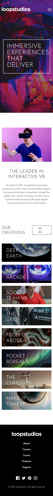

# Frontend Mentor - Loop Studio Landing page

This is a solution to the [Loop Studio Landing page](https://www.frontendmentor.io/challenges/loopstudios-landing-page-N88J5Onjw). Frontend Mentor challenges help you improve your coding skills by building realistic projects. 

## Table of contents

- [Overview](#overview)
  - [The challenge](#the-challenge)
  - [Screenshot](#screenshot)
  - [Links](#links)
- [My process](#my-process)
  - [Built with](#built-with)
- [Author](#author)

## Overview

### The challenge

Your users should be able to:

- View the optimal layout for the site depending on their device's screen size
- See hover states for all interactive elements on the page

### Screenshot
| Desktop version                              |               Mobile Version                |
| -------------------------------------------- | :-----------------------------------------: |
|  |  |

### Links

- Solution URL: [solution URL](https://www.frontendmentor.io/solutions/loopstudio-landing-page-a6qG0TZgSB)
- Live Site URL: [Live site URL](mahdisohaily.github.io/loop-studio/)

## My process

### Built with

- Semantic HTML5 markup
- CSS custom properties
- Flexbox
- CSS Grid
- Mobile-first workflow
- [sass](https://sass-lang.com/) - CSS preprocessor
- [vite.js](https://vitejs.dev/) - Vite is a build tool
## Author

- Frontend Mentor - [@MahdiSohaily](https://www.frontendmentor.io/profile/MahdiSohaily)
- Twitter - [@Mahdi_Rezaei_AF](https://twitter.com/Mahdi_Rezaei_AF)
